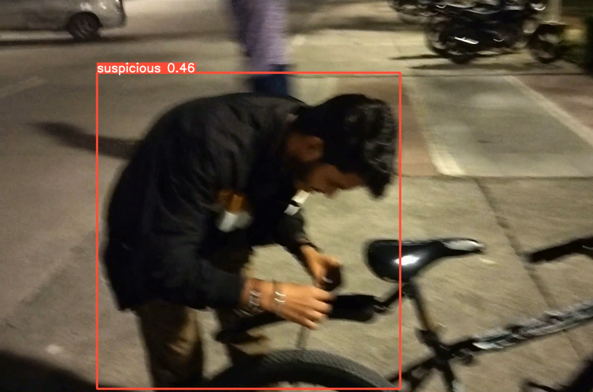

## Night_Watch

### A Ai/ML model to find the suspicious activity or stealing of cycles activity using the camera footage or videos

## tools Used
  <ul>
    <li>Google Colab & VS Code with libraries</li>
    <li>yolov5</li>
    <li>Open cv</li>
    <li>GPU</li>
  </ul>
  
## GitHub Repository Structure
  <ul>
    <li>dataset : Directory containing the dataset (images)</li>
    <li>Night_watch.ipynb : file take the yolov5 real time objective detection model then we give our dataset here to learn our dataset and it builds a model</li>
    <li>custom.yaml : Directory which give the path of our dataset</li>
    <li>cycle_theft: file to run the model after downloading it with live webcam</li>
    <li>demo.mp4: file for testing the model</li>
    <li>problemStatement_year_4.pdf : problem statement of the problem</li>
  </ul>

## Working 
  ### 1. Data Collection and training : 
  <ul>
    <li>Dataset : It consist of Images for training and testing, including normal and suspicious events related to cycle theft. </li>
    <li>Training : Images frames were extracted and resized for compatibility with the model.</li>
  </ul>

  ### 2. Anomaly Detection : 
  <ul>
    <li>Confidence : First step of thief detection is on its confidence level like for confidence at least 80 percent</li>
    <li>Time Spent : second step of thief detection is on the time spent working with opening the lock </li>
  </ul>
      <h5> it both condition are satisfying then our model prints it as a thief </h5>

    
## How to run
  <ul>
    <li>Before running the any terminal make sure you are running your notebook on GPU instead of CPU. To check just go on runtime/change runtime type it should be on GPU</li>
    <li>First download the ipynb file</li>
    <li>Run the first kernel to download the some files and dependencies for yolov5</li>
    <li>Now we need to add a file custom.yaml inside the yolov5/data folder</li>
    <li>Add the dataset folder into your drive </li>
    <li>Run the secong kernel of notebook it will connect to you drive to fetch the dataset</li>
    <li>now run third terminal for prediction or model validation</li>
    <li>now to test the model that it is running fine or now upload the demo.mp4 file inside your notebook</li>
    <li>Now run the fourth terminal to run the model in our video</li>
    <li>Download the video from the directory yolov5/runs/detect then download the demo.mp4 file again and run it you will see some prediction there</li>
  </ul>

## Run on live webcam
  to run on live webcam 
  <ul>
    <li>First Download the last.pt model which after running the above steps</li>
    <li>Download from the directory yolov5/models/last.pt model </li>
    <li>put the path of your last.pt model inside the cycle_theft.ipynb jupyter file in the path</li>
    <li>After running make sure you have permission of your webcam to open then you will able to see that model is working</li>
  </ul>
  
## For more you see our presentation uploaded on repository

## Conclusion
  The cycle theft detection model combines the power of yolov5 architecture to identify suspicious events in video footage. By leveraging deep learning techniques, this model offers a reliable solution    for enhancing security and preventing cycle theft incidents even in low light and poor image quality conditions.

https://github.com/ARinger22/Night_Watch_ML/assets/110568866/d35c6264-2d9b-413d-8ea1-d508ce11f9ac

